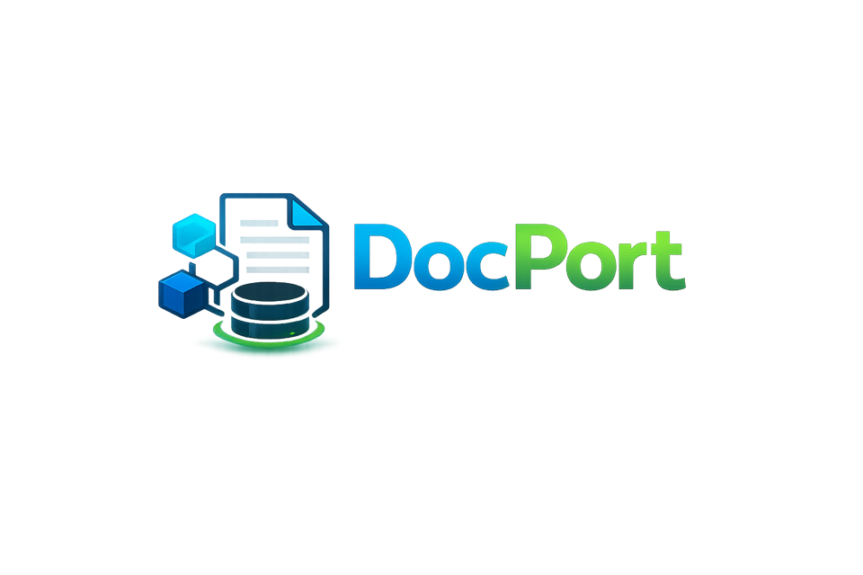

`DocPort` stands for Document Port.
It is a typed document-store library for Python services that follow hexagonal architecture and ports-and-adapters boundaries.
It gives applications one entity model, one repository port, and one MongoDB adapter set for sync code and `asyncio` code.
The package keeps driver details at the edge and keeps the domain model in plain Python classes backed by Pydantic.

The repo uses `uv`, Ruff, `pre-commit`, and `pre-push` hooks.
The package layout follows ports and adapters.
Tests run in memory with `mongomock` so the default feedback loop stays fast and local.

## Design intent

This library exists to give Python services one stable persistence contract for document data.
The domain object is `DocPortEntity`.
Each instance has a stable identity, audit metadata, version data for optimistic concurrency, and room for domain methods.
Pydantic gives validation, serialization, and JSON Schema generation through normal `BaseModel` behavior.

MongoDB stays behind the adapter boundary.
Entities use `id` as the cross-service key.
Mongo keeps `_id` for its own internal work.
That split makes API contracts cleaner and keeps domain code free of driver-native details.
It follows the design rule that canonical models stay in application code while storage mechanics stay at the edge.

The first adapter set targets MongoDB.
The public store contract does not know about [MoleQL](https://github.com/OneTesseractInMultiverse/moleql).
That choice is deliberate.
[MoleQL](https://github.com/OneTesseractInMultiverse/moleql) can sit on top of `docport` and hand off filters, sort pairs, limits, skips, and projections without turning the store layer into a query-language package.

## Install

With `uv`:

```bash
uv add docport
```

For an existing virtual environment managed directly with `uv pip`:

```bash
uv pip install docport
```

With `pip`:

```bash
pip install docport
```

The package requires Python 3.12 or newer.

## Quick start

```python
from docport import FindOptions, MongoStore, Projection, DocPortEntity
from pymongo import MongoClient


class User(DocPortEntity):
    name: str
    last_name: str
    email: str


class UserStore(MongoStore[User]):
    entity_type = User
    collection_name = "users"

    def get_by_email(self, email: str) -> User | None:
        return self.find_one({"email": email})


client = MongoClient("mongodb://localhost:27017")
database = client.get_database("app")
store = UserStore(database=database)

created = store.add(
    User(name="Ana", last_name="Diaz", email="ana@example.com"),
    actor="identity-service",
)

loaded = store.get(created.id)
summary_rows = store.find_projected(
    {"name": "Ana"},
    options=FindOptions(projection=Projection.include("name", "email")),
)
```

The `add()` call returns the stored entity.
The adapter fills `created_by` and `updated_by` if the caller passes an `actor`.
The `find_projected()` call returns detached dictionaries.
That keeps partial reads honest.
A partial read is not a full entity.

### Quick start with [MoleQL](https://github.com/OneTesseractInMultiverse/moleql)

Some services use `docport` and [MoleQL](https://github.com/OneTesseractInMultiverse/moleql) together.
`docport` does not import `moleql`.
The service calls `parse()` and passes the plain result into `FindOptions`.

```python
from moleql import parse
from docport import FindOptions


raw_query = (
    "status=active"
    "&sort=-updated_at,name"
    "&skip=20"
    "&limit=10"
    "&fields=id,name,email"
)

parsed = parse(raw_query)
options = FindOptions.from_values(
    sort=parsed["sort"],
    skip=parsed["skip"],
    limit=parsed["limit"],
    projection=parsed["projection"],
)

rows = store.find_projected(
    parsed["filter"],
    options=options,
)

total = store.count(parsed["filter"])
```

This query returns a projected page of rows.
`skip=20` and `limit=10` control the page slice.
`fields=id,name,email` turns the read into a projection query.
The same parsed `filter` can go to `count()` for page totals.

## Asyncio support

The package ships a parallel async store port and a MongoDB async adapter.
The API stays close to the sync side, so services can keep one mental model for both execution styles.

```python
from pymongo import AsyncMongoClient
from docport import AsyncMongoStore, FindOptions, Projection, DocPortEntity


class AuditRecord(DocPortEntity):
    message: str


class AuditStore(AsyncMongoStore[AuditRecord]):
    entity_type = AuditRecord
    collection_name = "audit_records"


client = AsyncMongoClient("mongodb://localhost:27017")
database = client.get_database("app")
store = AuditStore(database=database)

record = await store.add(AuditRecord(message="actor signed in"), actor="auth-service")
rows = await store.find_projected(
    {"id": record.id},
    options=FindOptions(projection=Projection.include("id", "message")),
)
```

The async adapter uses the PyMongo async API.
It does not rely on `motor`.
The repo tests the async adapter against a thin async wrapper over `mongomock`, so the local test path stays self-contained.

## Interaction context

`StoreOperationContext` carries `correlation_id`, `causation_id`, and `actor`.
Pass one in at the service edge and reuse it through the full flow.
The adapter creates a new `correlation_id` when the caller does not pass one.

```python
from docport import StoreOperationContext


context = StoreOperationContext.create(
    correlation_id="corr-2026-04-13-001",
    causation_id="msg-4471",
    actor="identity-service",
)

created = store.add(
    User(name="Ana", last_name="Diaz", email="ana@example.com"),
    context=context,
)
```

The explicit `actor=` argument still works.
That value replaces `context.actor` for one call.

## Entity model

`DocPortEntity` is the base class for persisted records.
It inherits from `BaseModel` and adds a small set of metadata fields that every service can count on.

| Field | Meaning |
| --- | --- |
| `id` | Stable cross-service identity |
| `created_at` | First creation time in UTC |
| `updated_at` | Last write time in UTC |
| `created_by` | Service, user, or system that created the record |
| `updated_by` | Service, user, or system that made the last change |
| `version` | Positive integer for optimistic concurrency |

`touch()` returns a new entity with a new `updated_at` value and the next `version`.
The Mongo adapter uses that method for `update()`.
This keeps concurrency logic in one place and keeps update rules explicit.

`DocPortTimeSeriesEntity` extends `DocPortEntity` with `observed_at`.
Use it for MongoDB time-series collections.
`created_at` and `updated_at` still describe record lifecycle.
`observed_at` marks the time axis of the measured fact.

## Store contract

The core port is `Store[T]` for sync code and `AsyncStore[T]` for async code.
Each port starts with the standard repository methods:

```python
get()
list()
add()
update()
delete()
```

The port adds three query helpers that services usually need in real work.
`count()` returns a count for a filter.
`find()` returns full entities for a filter.
`find_projected()` returns partial documents or typed projection models.

This split matters.
A full entity and a partial document do not carry the same guarantees.
`find()` rejects projections.
`find_projected()` requires a projection.
That rule stops one of the most common ODM mistakes, which is treating a partial document as a valid aggregate.

## Errors and observation data

The store boundary raises domain errors for record rules.
`DuplicateEntityError`, `EntityNotFoundError`, and `EntityVersionConflictError` cover the main write cases.
Driver and transport faults raise `StoreDependencyError`.
Public error text stays safe.
Raw driver text stays out of the exception message.

A store can take `observability_hook=...`.
The hook receives `StoreObservation` records with stable field names.
Those fields are `correlation_id`, `causation_id`, `actor`, `action`, `target`, `outcome`, `error_code`, `duration_ms`, `entity_type`, and `collection_name`.
That record shape fits logs, metrics tags, traces, and audit events without exposing raw filters or document payloads.

```python
from docport import MongoStore, StoreObservation


class PrintHook:
    def record(self, observation: StoreObservation) -> None:
        print(observation.as_log_fields())


store = UserStore(database=database, observability_hook=PrintHook())
```

## Projection results

Projection support is a first-class part of the library.
This matters for list pages, summaries, search screens, and [MoleQL](https://github.com/OneTesseractInMultiverse/moleql)-fed query paths.
The store gives two return styles.

If the caller wants maximum flexibility, `find_projected()` returns raw dictionaries.
That is a good fit for ad hoc data export, generic query layers, and code that needs to pass JSON-shaped data to another layer.

If the caller wants a typed partial record, `find_projected()` accepts a Pydantic model in `result_type`.
That is a good fit for stable read models, API response models, and service code that wants field validation on the projected shape.

```python
from pydantic import BaseModel
from docport import FindOptions, Projection


class UserSummary(BaseModel):
    name: str
    email: str


rows = store.find_projected(
    {"name": "Ana"},
    options=FindOptions(projection=Projection.include("name", "email")),
    result_type=UserSummary,
)
```

The library does not return `DocPortEntity` from a projected query.
That is by design.
An entity should represent the whole aggregate that the domain relies on.
A projection should represent a read shape.

## [MoleQL](https://github.com/OneTesseractInMultiverse/moleql) Handoff

`docport` does not import [MoleQL](https://github.com/OneTesseractInMultiverse/moleql).
The handoff point is plain Python data.
[MoleQL](https://github.com/OneTesseractInMultiverse/moleql) already returns a `filter`, `sort`, `skip`, `limit`, and `projection`.
That result maps cleanly into `FindOptions`.

```python
from moleql import parse
from docport import FindOptions


query = parse("name=Ana&sort=-created_at&fields=name,email")

rows = store.find_projected(
    query["filter"],
    options=FindOptions.from_values(
        sort=query["sort"],
        skip=query["skip"],
        limit=query["limit"],
        projection=query["projection"],
    ),
)
```

This keeps each package focused.
[MoleQL](https://github.com/OneTesseractInMultiverse/moleql) parses user-facing query strings.
`docport` handles entity rules and persistence contracts.
The boundary between them is plain data, so the two libraries can move at different speeds.

If `projection` is `None`, pass the parsed values to `find()`.
If `projection` has a value, pass the parsed values to `find_projected()`.
That split keeps full entity reads and partial reads clear at the call site.

## Repo layout

```text
src/docport/
  domain/
  ports/
  adapters/
tests/
docs/
```

`domain` owns entities, query helpers, and error types.
`ports` owns the repository contracts.
`adapters` owns MongoDB document mapping and sync or async store implementations.

## Local development

Set up the repo with `uv`:

```bash
uv sync --group dev
make install-hooks
```

Run the normal local checks:

```bash
make check
```

Run the hooks against the whole repo:

```bash
make hooks
```

The default `make test` target runs the full test suite with coverage and fails below 100 percent.

## Publishing

Release builds are handled by the GitHub Actions workflow in `.github/workflows/ci-cd.yml`.
Pushing a `v*` tag or running the workflow manually with publishing enabled builds the package and publishes it to PyPI through trusted publishing.

Build locally before tagging:

```bash
make check
make build
```

## MongoDB notes

`docport` expects `id` to be the service-visible identity.
A collection should keep a unique index on that field.
The adapter does not create that index on its own.
Collection provisioning stays outside the library so service owners keep control over migrations and rollout timing.

For time-series collections, `DocPortTimeSeriesEntity` uses `observed_at` as the default time field.
Services can keep measurement data in their entity class and still use the same audit metadata model as the rest of the platform.

## Extra docs

The repo keeps the deeper design notes in `docs/`.
Start with these pages:

- [Entity and Store Design](docs/entity-and-store-design.md)
- [Observability and Error Handling](docs/observability-and-error-handling.md)
- [Projections and MoleQL Integration](docs/projections-and-moleql-integration.md)
- [Testing Guide](docs/testing-guide.md)
- [ADR 0001 Store Observation and Error Boundary](docs/adrs/0001-store-observation-and-error-boundary.md)
- [Pre-Commit Setup](docs/pre-commit-setup.md)
