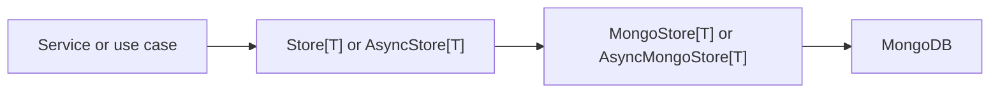

# Entity and Store Design

This page explains the core design choices in `docport`.
The goal is one shared mental model for entity classes, store ports, and MongoDB adapters.

## Why the base class is `DocPortEntity`

The library uses the word `entity` on purpose.
These objects have identity and lifecycle.
They are not just data transfer records.
Each one carries a stable `id`, audit timestamps, actor fields, and a `version`.
That makes `DocPortEntity` a better name than `DocumentModel` for the main persisted type.

Pydantic is still central.
`DocPortEntity` inherits from `BaseModel`.
A subclass keeps all the normal Pydantic features that Python services rely on today.
That includes field validation, serialization, JSON Schema generation, and smooth use with FastAPI.

The naming split for partial reads is simple.
Full persisted records are entities.
Projected read shapes are plain dictionaries or dedicated Pydantic models.
That keeps domain language precise and keeps partial data from posing as a full aggregate.

## Audit metadata

The metadata set is small and deliberate.
Each field answers one operational question.

| Field | Operational question |
| --- | --- |
| `id` | Which record is this across service boundaries |
| `created_at` | When did this record enter the store |
| `updated_at` | When did the last write happen |
| `created_by` | Which actor created the record |
| `updated_by` | Which actor made the last change |
| `version` | Which write generation is current |

The timestamps are always timezone-aware and normalized to UTC.
That keeps audit trails consistent and keeps MongoDB BSON dates predictable across services and jobs.

`version` starts at `1`.
Each `update()` call writes the next version.
The adapter matches on the current `id` and `version`.
If another writer wins first, the stale writer gets `EntityVersionConflictError`.
That gives the platform a clear concurrency rule without hidden retry logic in the domain layer.

## Why Mongo `_id` stays hidden

MongoDB needs `_id`.
Service code rarely should.
`docport` keeps `_id` behind the adapter boundary and uses `id` as the cross-service identity.

This split has three good effects.
The API surface stays stable.
The domain model stays free of driver detail.
A future adapter for another document database can keep the same entity contract.

The adapter still supports projected reads that need `_id`.
A typed projection model can ask for `_id` through a Pydantic alias.
That keeps the escape hatch available without moving `_id` into every entity.

## Ports and adapters

The store contract follows the playbook rule that persistence sits behind a port.
The application or service layer speaks to `Store[T]` or `AsyncStore[T]`.
MongoDB lives in `MongoStore[T]` and `AsyncMongoStore[T]`.



This shape keeps domain code free of collection objects and driver calls.
It fits the repository pattern and the playbook rule that callers ask for behavior, not for nested internals.

## Call context and boundary data

Each public store call can take `StoreOperationContext`.
The context keeps `correlation_id`, `causation_id`, and `actor` stable through one flow.
The adapter can create a fresh context when the caller omits one.
That keeps service code small and keeps boundary data present for tests, logs, traces, and audit records.

A store can take an observability hook.
The hook receives `StoreObservation` records at start and finish.
The record keeps safe fields only.
It does not include raw filters, raw document payloads, secrets, or driver text.

## Query helpers

The base CRUD methods are there for the common path.
Real services need more than CRUD, so the port adds `count()`, `find()`, `find_one()`, and `find_projected()`.

`find()` and `find_one()` hydrate full entities.
They reject projections.
`find_projected()` does the reverse and requires a projection.
This line is strict, and that is good.
It keeps aggregate invariants honest.

`FindOptions` carries sort rules, `skip`, `limit`, and projection data.
`Projection` gives a small builder for inclusion and exclusion reads.
The builder defaults to hiding Mongo `_id` for inclusion projections.
That keeps projected rows clean for API work and typed read models.

## Store subclass pattern

The library is built for the pattern below:

```python
from docport import MongoStore, DocPortEntity


class User(DocPortEntity):
    name: str
    email: str


class UserStore(MongoStore[User]):
    entity_type = User
    collection_name = "users"

    def get_by_email(self, email: str) -> User | None:
        return self.find_one({"email": email})
```

This gives a clean path for domain-specific repository methods.
The base adapter still owns document mapping, projection handling, and concurrency checks.
The subclass adds domain vocabulary.

## Time-series records

`DocPortTimeSeriesEntity` adds `observed_at`.
That field marks the time axis of the measured fact.
`created_at` and `updated_at` keep their normal meaning and describe record lifecycle.

This matters for services that ingest measurements late.
A metric can be observed at `08:00` and written at `08:05`.
Both facts matter.
The entity model keeps them separate.
