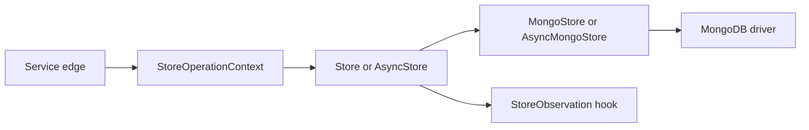
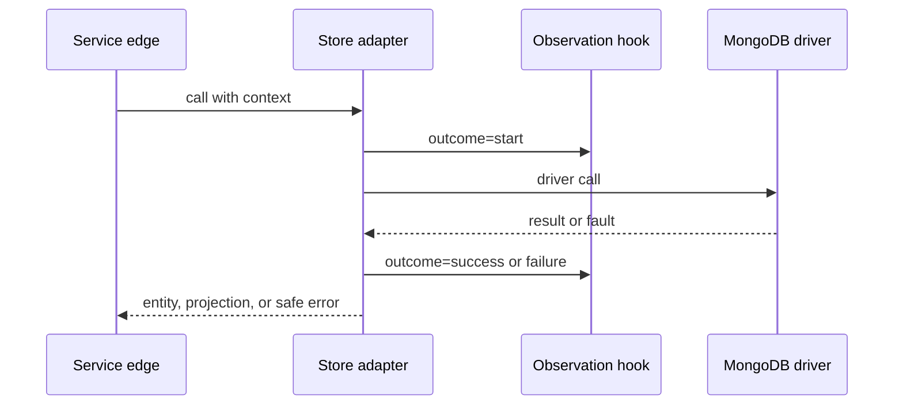

# Observability and Error Handling

This page defines the public boundary for store errors and boundary data.
The goal is stable caller behavior and stable operator data.

## Boundary view

The service edge creates or receives the context.
The store boundary reuses that context for the full call.
The adapter emits safe observation records through the hook.
The driver stays behind the adapter.

## Flow

## Interaction context

`StoreOperationContext` holds `correlation_id`, `causation_id`, and `actor`.
The caller can pass the context into any public store method.
The adapter creates a new `correlation_id` when the caller omits one.
That keeps every call traceable without extra setup.

`correlation_id` stays stable through the full flow.
`causation_id` links follow-up work to the prior event.
`actor` identifies the service, system, or user that triggered the call.
The `actor=` method argument still works.
That argument replaces `context.actor` for one call.

## Error boundary

The store uses domain errors for record rules.
`DuplicateEntityError` reports a duplicate write.
`EntityNotFoundError` reports a missing record on update.
`EntityVersionConflictError` reports a stale write.

The store uses infrastructure errors for driver, transport, and dependency faults.
`StoreDependencyError` is the current adapter error for `PyMongoError` failures.
The adapter does not pass raw driver text through the public error message.

At the service edge, map domain errors and infrastructure errors into safe replies or message outcomes.
Carry the `correlation_id` into the reply body, response header, or message metadata.
Keep raw driver text out of the transport body.

## Observation record

`StoreObservation` exposes a fixed field set.
The fields are `correlation_id`, `causation_id`, `actor`, `action`, `target`, `outcome`, `error_code`, `duration_ms`, `entity_type`, and `collection_name`.
The `as_log_fields()` helper returns those names in a plain dictionary.

The record avoids raw filters, raw document payloads, tokens, credentials, and personal data fields.
That makes the hook safe for logs, metrics tags, traces, and audit events.
Service teams still own the final sink policy.

## Ownership notes

Service owners create or receive the context at the first edge.
Transport owners map public errors to HTTP, RPC, or message outcomes.
Platform owners keep the field names and error codes stable.
Operations teams bind the hook to log, metric, trace, and audit sinks that have a named owner.

## Evidence

The implementation lives in [src/docport/domain/observability.py](../src/docport/domain/observability.py), [src/docport/adapters/mongo_store.py](../src/docport/adapters/mongo_store.py), and [src/docport/adapters/async_mongo_store.py](../src/docport/adapters/async_mongo_store.py).
The behavior is covered in [tests/docport/domain/test_observability.py](../tests/docport/domain/test_observability.py), [tests/docport/adapters/test_mongo_store.py](../tests/docport/adapters/test_mongo_store.py), and [tests/docport/adapters/test_async_mongo_store.py](../tests/docport/adapters/test_async_mongo_store.py).
